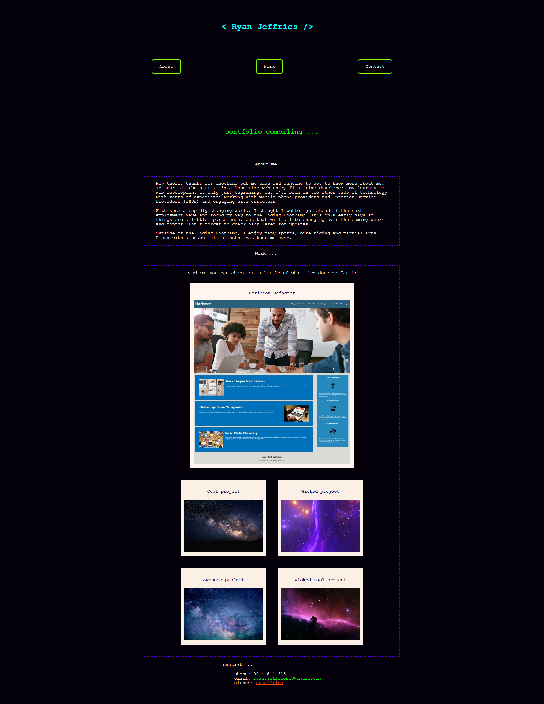
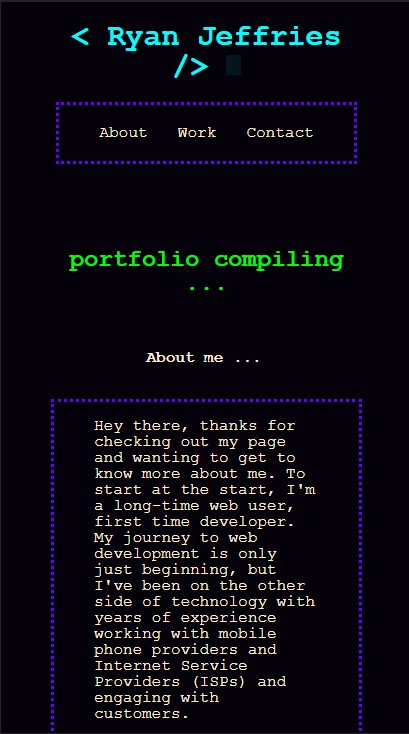

# Portfolio creation

## Description

This project is to create a portfolio of various completed web
development deployments. This portfolio page was designed by me from 
scratch, utilising html and css coding. I wanted a retro type feel 
to the design as a throwback to when I first started using computers. 

Creating the portfolio presented challenges of ensuring that content
would be flexible and resize with changing screen sizes. This meant using flex-box and media queries to allow content to change position, 
shrink and grow as needed. I also used this to slightly change the look
of the page and elements as the screen size gets smaller. 

This page also includes a footer with contact details and link to my 
github. 

## Screenshots

Screenshot of portfolio full size 

Screen shot of portfolio mobile size 

## Links

* Github repository for my porftolio [Github repository](https://github.com/RHJeffries/Portfolio)

* Deployed portfolio page [deployed portfolio page](https://rhjeffries.github.io/Portfolio/)

## Credits

